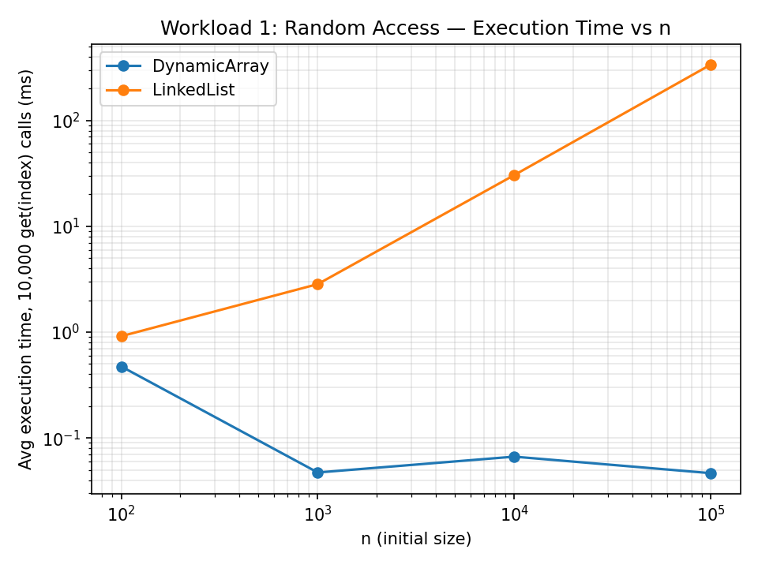
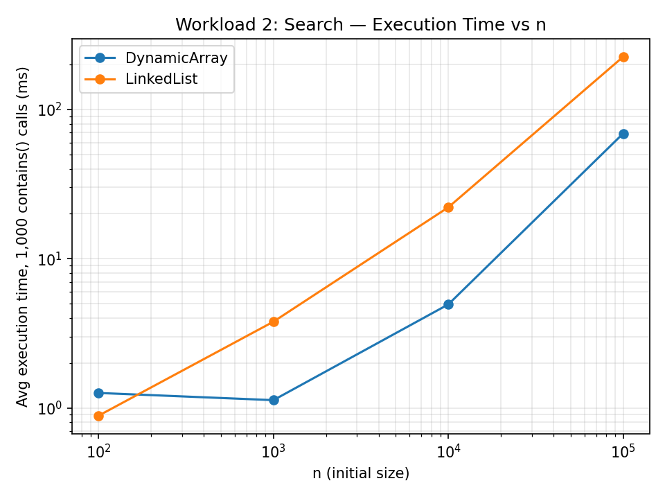
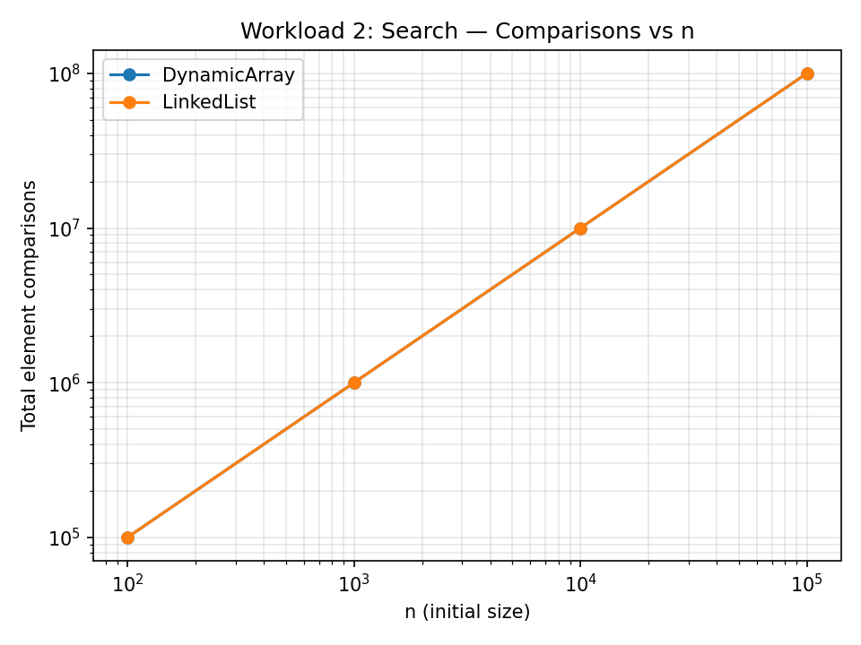
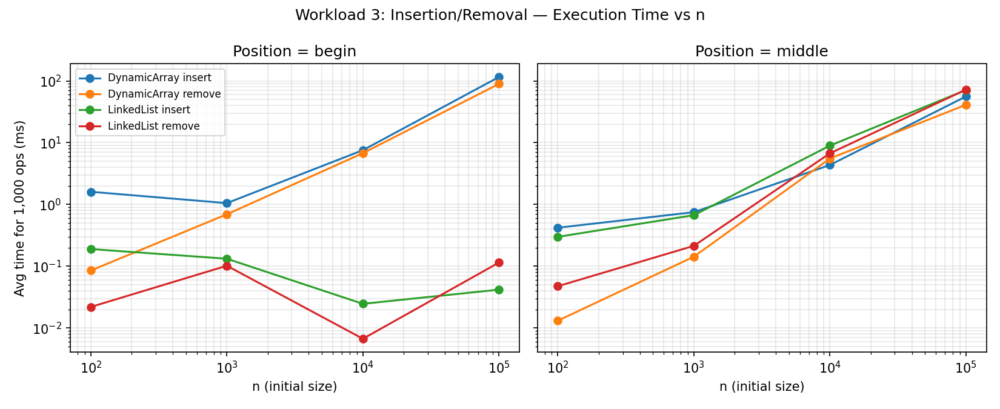
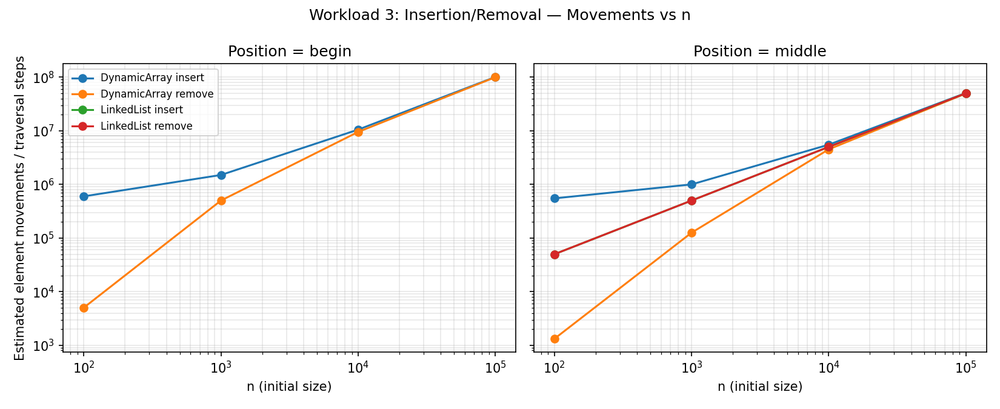
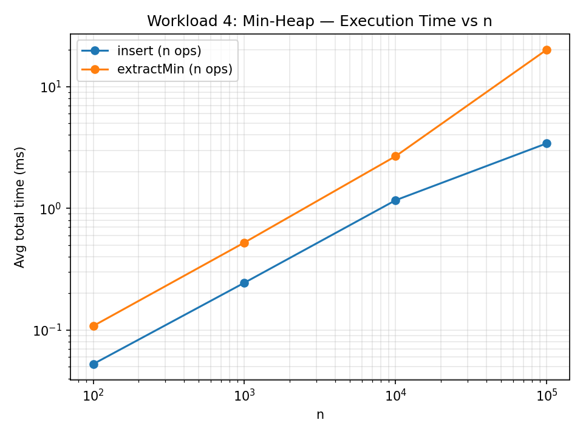
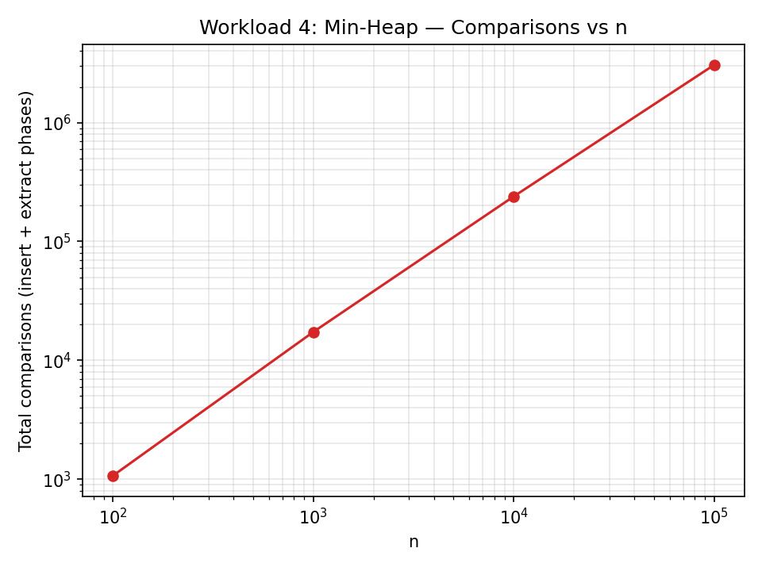

# Assignment 2 — Algorithmic Analysis, Correctness and Performance Trade-offs

## 1. Overview

This project implements and analyzes three fundamental data structures in Java:

- **Dynamic Array** — a resizable array backed by `Object[]`, doubling capacity on overflow.
- **Linked List** — a custom doubly linked list (own `Node<T>` class, not `java.util.LinkedList`).
- **Min-Heap** — a binary min-heap backed by an `int[]`, supporting `insert`, `peekMin`, `extractMin`.

The goal is not just to implement these structures, but to **prove their correctness** with loop
invariants, **derive their asymptotic complexity**, and **empirically validate** that complexity
through controlled, repeatable benchmarks across input sizes n = 100, 1,000, 10,000, 100,000.

Source layout:

```
assignment-2/
├── src/
│   ├── DynamicArray.java
│   ├── LinkedList.java
│   ├── MinHeap.java
│   ├── Benchmark.java
│   └── Tests.java
├── results/
│   ├── tables/   (CSV output from Benchmark.java)
│   └── plots/    (PNG charts generated from the CSVs)
└── README.md
```

---

## 2. Complexity Analysis

n = number of elements currently stored. Index-based operations assume a uniformly random index
unless stated otherwise.

### 2.1 Dynamic Array

| Operation | Best | Average | Worst | Auxiliary Space |
|---|---|---|---|---|
| `add(x)` (append) | Θ(1) | Θ(1) amortized | O(n) (on resize) | O(1) amortized, O(n) on resize (copy) |
| `add(index, x)` | Ω(1) — index = size (no shift) | Θ(n) | O(n) — index = 0 | O(1) |
| `remove(index)` | Ω(1) — index = last | Θ(n) | O(n) — index = 0 | O(1) |
| `get(index)` | Θ(1) | Θ(1) | Θ(1) | O(1) |
| `contains(x)` | Ω(1) — match at index 0 | Θ(n) | O(n) — no match / match at end | O(1) |

**Justification.** `get(index)` computes a direct memory offset (`data[index]`), independent of
`n` or where the target sits — hence Θ(1) in *every* case, not just on average. `add`/`remove` at
an arbitrary index require shifting all elements between `index` and the end of the array by one
slot, which costs `n − index` element moves; averaging over a uniformly random index gives Θ(n)
on average (≈ n/2 moves), while inserting/removing at index 0 forces the maximum n moves (worst
case) and at the tail forces zero moves (best case). Appending is Θ(1) *amortized*: doubling the
backing array when full means the total cost of n appends starting from an empty array is O(n),
so each append costs O(1) on average across a sequence, even though any single append that
triggers a resize costs Θ(n) in isolation.

### 2.2 Linked List (doubly linked, our implementation)

| Operation | Best | Average | Worst | Auxiliary Space |
|---|---|---|---|---|
| `add(x)` (append, tail pointer kept) | Θ(1) | Θ(1) | Θ(1) | O(1) |
| `add(index, x)` | Ω(1) — index = 0 or size | Θ(n) | O(n) — index = n/2 | O(1) |
| `remove(index)` | Ω(1) — index = 0 or size−1 | Θ(n) | O(n) — index = n/2 | O(1) |
| `get(index)` | Ω(1) — index = 0 or n−1 | Θ(n) | O(n) — index = n/2 | O(1) |
| `contains(x)` | Ω(1) — match at head | Θ(n) | O(n) — no match / match at tail | O(1) |

**Justification.** Every index-based operation must first *traverse* the list to reach the target
node, because there is no random-access memory offset the way an array has. Our implementation
traverses from whichever end (head or tail) is nearer to `index`, which halves the constant
factor (worst case is `index = n/2`, costing ~n/2 steps) but does **not** change the asymptotic
class — it is still Θ(n) on average and O(n) worst case. Once the target node is located,
insertion/removal is Θ(1) (pointer relinking only, no shifting of other elements) — this is the
structural advantage over the array once the node has been found.

### 2.3 Min-Heap

| Operation | Best | Average | Worst | Auxiliary Space |
|---|---|---|---|---|
| `insert(x)` | Ω(1) — new value ≥ its parent, no bubbling | Θ(log n) | O(log n) — bubbles to root | O(1) |
| `peekMin()` | Θ(1) | Θ(1) | Θ(1) | O(1) |
| `extractMin()` | Ω(1) — heap becomes empty/size 1, or moved element already satisfies heap property | Θ(log n) | O(log n) — sifts to a leaf | O(1) |

**Justification.** The heap is a complete binary tree stored in an array, so its height is always
`⌊log₂ n⌋`. `insert` appends at the next free slot (O(1)) then "sifts up" along a single root-path,
at most `log n` swaps. `extractMin` swaps the root with the last element, shrinks the array, then
"sifts down" along a single path, at most `log n` swaps, each doing O(1) comparisons among two
children. `peekMin` only reads `heap[0]`.

### 2.4 Operations that look similar but differ in practical cost

- **`get(index)`: Dynamic Array vs Linked List.** Both are "read the i-th element", but the array
  version is a single arithmetic offset + memory load (Θ(1) always), while the list version is a
  pointer-chasing walk (Θ(n) on average). This is the single clearest illustration in this
  assignment of why Big-O class alone doesn't capture real-world behavior for structurally
  different data layouts — see Workload 1.
- **`add(0, x)` vs `add(n, x)` on the same structure.** For the Dynamic Array these are worst case
  (O(n) shift) vs best case (O(1), no shift) respectively. For the Linked List, *both* are O(1)
  once located, because head and tail pointers are kept — the cost that differs is purely the
  *traversal* to reach the insertion point, which is trivial at both ends and only becomes
  expensive near the middle.
- **`insert(x)` vs `extractMin()` on the Min-Heap.** Both are O(log n), but `insert` only ever
  does one comparison per level (`child` vs `parent`), while `extractMin` does up to two
  comparisons per level (comparing both children to find the smaller, then to the moved value).
  `extractMin` is measurably ~2× more comparisons for the same n — visible in Workload 4.

---

## 3. Correctness — Loop Invariant Proofs

### 3.1 Proof 1: `DynamicArray.add(int index, T x)` (array insertion — shifting loop)

```java
for (int i = size - 1; i >= index; i--) {
    data[i + 1] = data[i];
}
data[index] = x;
size++;
```

**Loop invariant.** At the start of each iteration of the loop (indexed by the current value of
`i`, decreasing from `size - 1` down to `index`):
*Every element that originally occupied a position `k` with `i < k < size` has already been
copied to position `k + 1`, and every element originally at a position `k` with `index ≤ k ≤ i`
still resides at its original position `k` (unmoved).*

**Initialization.** Before the first iteration, `i = size - 1`. The invariant's first clause is
vacuously true (there is no `k` with `size - 1 < k < size`). The second clause holds trivially:
every original element from `index` to `size - 1` is still exactly where it started, since no
copy has happened yet.

**Maintenance.** Assume the invariant holds at the start of an iteration with current index `i`
(where `i ≥ index`). The loop body executes `data[i + 1] = data[i]`, copying the element currently
at position `i` (which, by the invariant, is still the *original* element from position `i`,
since the invariant says positions `index..i` are unmoved) into position `i + 1`. After this
assignment:
- The element originally at position `i` is now correctly at position `i + 1`, extending the
  first clause's range down to include `k = i`.
- Positions `index..i-1` remain untouched by this iteration, so the second clause continues to
  hold for the new (decremented) value of `i`.

Thus the invariant is re-established for the next iteration (with `i` decremented by one).

**Termination.** The loop terminates when `i < index`, i.e. after the iteration where `i = index`
has executed. At that point, by the (maintained) invariant, every original element from position
`index` to `size - 1` has been copied one slot to the right, landing at positions `index+1` to
`size`. No element originally at a position `< index` was ever touched, since the loop never
reaches `i < index`.

**Why this proves correctness.** After the loop, the array satisfies: positions `0..index-1`
hold their original, undisturbed contents; positions `index+1..size` hold exactly the original
contents of positions `index..size-1`, shifted right by one; and position `index` is free. The
subsequent statement `data[index] = x` places the new element exactly there, and `size++` records
the new logical length. This is precisely the specification of "insert `x` at `index`, shifting
the tail right by one" — so the loop, together with the two statements after it, is correct.

### 3.2 Proof 2: `MinHeap.extractMin()` — sift-down loop

```java
int i = 0;
while (true) {
    int l = left(i), r = right(i);
    int smallest = i;
    if (l < size && heap[l] < heap[smallest]) smallest = l;
    if (r < size && heap[r] < heap[smallest]) smallest = r;
    if (smallest == i) break;
    swap(i, smallest);
    i = smallest;
}
```
(This runs *after* `heap[0]` has been saved as the minimum to return, and the former last element
has been moved into `heap[0]`, with `size` already decremented.)

**Loop invariant.** At the start of each iteration, with current index `i`:
*For every index `j` in the array with `0 ≤ j < size` such that `j` is **not** on the path from
the root to `i` (i.e., `j` is not an ancestor of `i` and `j ≠ i`), and such that `j`'s parent is
also not on that path, the subtree rooted at `j` satisfies the heap property. Equivalently: the
only place the heap property can currently be violated is between `i` and its own children* (the
element at `i` may be larger than one or both of its children, but every other parent–child
relationship in the array is valid).

**Initialization.** Before the first iteration, `i = 0` (the root). By construction, immediately
prior to entering the loop, only the root's relationship to its children is potentially invalid
(a value from the last leaf position was just placed there); every other subtree not containing
position 0 as an internal disagreement point is untouched from a previously-valid heap and hence
still satisfies the heap property between all other parent-child pairs. So the invariant holds
trivially at the start.

**Maintenance.** Assume the invariant holds at the start of an iteration with current `i`. The
loop computes `smallest` as whichever of `i`, `left(i)`, `right(i)` holds the minimum value (only
considering children that exist, i.e., `< size`). Two cases:

- If `smallest == i`: the element at `i` is already ≤ both of its children (or has no children),
  so the parent–child relationship at `i` is valid, and — by the invariant — every other
  parent–child relationship in the array was already valid. The heap property therefore holds
  everywhere. The loop breaks.
- If `smallest ≠ i`: `swap(i, smallest)` exchanges the two values. This fixes the (previously
  possibly invalid) relationship between `i` and its children, because the smaller of the two
  values is now at `i` (≤ the other child, and ≤ the value now at `smallest`, since it was chosen
  as the minimum among all three). The relationship between `i` and its *parent* was already
  valid before the swap only in the sense that `i`'s parent is untouched — the invariant does not
  claim anything about `i`'s parent, since `i` was already known to be the (only) possible
  violation site and the value moving into `i` is *smaller* than what was there before,
  so if `parent(i) ≤ old heap[i]` held, then `parent(i) ≤ new heap[i]` still holds (the new value
  is ≤ the old one). The new possible violation is pushed down to `smallest` (now holding the
  old, larger, root-of-subtree value), which becomes the new `i` for the next iteration — matching
  the invariant's statement that the only violation site is at the (new) current index.

**Termination.** Each iteration either breaks (done) or moves `i` strictly downward to one of its
children, i.e., strictly deeper into the tree. Since the tree has finite height `⌊log₂ size⌋`, `i`
can descend at most that many times before reaching a leaf (no children, so `l ≥ size` and
`r ≥ size`, forcing `smallest == i` and the loop breaks). Hence the loop terminates after at most
O(log n) iterations.

**Why this proves correctness.** At termination, `smallest == i`, which by the argument above
means every parent-child pair in the entire array satisfies `heap[parent] ≤ heap[child]` — this
is exactly the min-heap class invariant. Combined with the value removed being the pre-loop
`heap[0]` (the previous minimum, by the heap property that held before this call), `extractMin`
correctly returns the minimum and leaves a valid min-heap of size `n − 1` behind.

---

## 4. Experimental Setup

- **n (initial size):** 100; 1,000; 10,000; 100,000 (same four values for every applicable
  workload).
- **m (operations per workload):** 10,000 `get` calls (Workload 1), 1,000 `contains` calls
  (Workload 2), 1,000 insertions + 1,000 removals at two positions (Workload 3), n inserts + n
  extracts (Workload 4).
- **Repetitions:** every timed experiment is run 5 times; the arithmetic mean is reported.
- **Timing:** `System.nanoTime()`, wrapping only the operation loop — input generation (random
  data, random index/value lists) happens before the timer starts and is excluded.
- **Random seed:** `new Random(42)` (with small fixed offsets, e.g. `42 + 1`, `42 + 2`, for
  independent streams such as search values vs. structure contents) so every run is reproducible.
- **Environment note:** all four sizes run inside the same JVM process (`Benchmark.main`), so the
  smallest sizes (n = 100, 1,000) are measured before the JIT compiler has fully warmed up,
  which is visible as noisier/non-monotonic timings at small n in Workloads 1 and 3 — this is
  discussed explicitly below rather than hidden.
- **Correction applied during development:** an earlier version of Workload 3 generated each
  random value to insert with `Random.nextInt()` *inside* the timed loop, which violated the
  "generate input before timing" rule above by letting RNG overhead leak into the measured time.
  This was caught during development and fixed by pre-generating all `m` values into an array
  before `System.nanoTime()` is called; the numbers reported in §5 for Workload 3 are from the
  corrected version.

Run with:
```
javac -d out src/*.java
java -cp out Benchmark
python3 plot_results.py   # generates results/plots/*.png from results/tables/*.csv
```

---

## 5. Results

### Workload 1 — Random Access (`get(index)`, 10,000 calls)

| Structure | n | Avg time (ns) | Accesses | Theoretical |
|---|---|---|---|---|
| DynamicArray | 100 | 473,840 | 10,000 | Θ(1) per call |
| LinkedList | 100 | 914,500 | 10,000 | Θ(n) per call |
| DynamicArray | 1,000 | 47,240 | 10,000 | Θ(1) |
| LinkedList | 1,000 | 2,838,560 | 10,000 | Θ(n) |
| DynamicArray | 10,000 | 66,660 | 10,000 | Θ(1) |
| LinkedList | 10,000 | 30,399,720 | 10,000 | Θ(n) |
| DynamicArray | 100,000 | 46,540 | 10,000 | Θ(1) |
| LinkedList | 100,000 | 336,025,460 | 10,000 | Θ(n) |



**Analysis.** The Linked List's time grows essentially linearly with n on the log-log plot — from
n = 1,000 to n = 100,000 (a 100× growth in n) its time grows from ~2.84 ms to ~336 ms, i.e.
~118×, matching Θ(n) closely. The Dynamic Array's time drops from n = 100 to n = 1,000 and then
stays essentially flat (47,240 → 66,660 → 46,540 ns) — this is a JIT warm-up artifact: n = 100
runs first, before the JVM has compiled `get()` to native code, so it is measured slower than the
later, "hot" runs, not because Θ(1) predicts growth. Once warmed up, the time is flat regardless
of n, exactly as Θ(1) predicts. Overall, results strongly agree with theory: the Dynamic Array is
the clear winner for random access, by 3–4 orders of magnitude at large n.

### Workload 2 — Search (`contains(value)`, 1,000 calls)

| Structure | n | Avg time (ns) | Comparisons | Theoretical |
|---|---|---|---|---|
| DynamicArray | 100 | 1,259,040 | 100,000 | Θ(n) |
| LinkedList | 100 | 886,660 | 100,000 | Θ(n) |
| DynamicArray | 1,000 | 1,126,860 | 1,000,000 | Θ(n) |
| LinkedList | 1,000 | 3,779,520 | 1,000,000 | Θ(n) |
| DynamicArray | 10,000 | 4,934,660 | 10,000,000 | Θ(n) |
| LinkedList | 10,000 | 22,064,380 | 10,000,000 | Θ(n) |
| DynamicArray | 100,000 | 68,942,540 | 100,000,000 | Θ(n) |
| LinkedList | 100,000 | 225,137,840 | 100,000,000 | Θ(n) |




**Analysis.** Comparison counts are **identical** between the two structures at every n (both
scan linearly through every element), confirming both have the same Θ(n) comparison complexity —
this is a case of *same Big-O, different constant factor*. Execution time diverges as n grows: at
n = 100 the Dynamic Array even measures slightly slower (1,259,040 ns vs. 886,660 ns) — again a
JIT warm-up artifact, since n = 100 is the first, not-yet-hot run — but by n = 100,000 the Dynamic
Array is about 3.3× faster (68.9 ms vs. 225.1 ms), because contiguous array scanning has excellent
CPU cache locality (sequential memory access, prefetch-friendly), while list traversal follows
heap-allocated pointers scattered in memory, causing many more cache misses per element visited.
Increasing n increases both time and comparisons roughly proportionally for both structures,
matching the linear prediction — comparisons scale exactly 10× for each 10× growth in n, as
expected for Θ(n).

### Workload 3 — Insertion and Removal (1,000 ops each, at index 0 and index n/2)

| Structure | n | Position | Operation | Avg time (ns) | Movements |
|---|---|---|---|---|---|
| DynamicArray | 100,000 | begin | insert | 154,905,300 | 100,499,500 |
| LinkedList | 100,000 | begin | insert | 51,820 | 0 |
| DynamicArray | 100,000 | begin | remove | 105,055,340 | 99,500,500 |
| LinkedList | 100,000 | begin | remove | 20,360 | 0 |
| DynamicArray | 100,000 | middle | insert | 77,087,520 | 50,499,500 |
| LinkedList | 100,000 | middle | insert | 100,540,880 | 50,000,000 |
| DynamicArray | 100,000 | middle | remove | 47,456,100 | 49,500,500 |
| LinkedList | 100,000 | middle | remove | 108,258,520 | 50,000,000 |

*(these numbers reflect the corrected version of the benchmark, where the m random values to
insert are pre-generated into an array before the timer starts, rather than being generated by
`Random.nextInt()` inside the timed loop — see the note at the end of §4)*

*(full table for all four n values is in `results/tables/workload3_insert_remove.csv`)*




**Analysis.**
- **Insertion/removal at the beginning:** the Dynamic Array pays O(n) shifting cost on *every*
  one of the 1,000 operations (worst case for the array), while the Linked List pays O(1) per
  operation (head pointer, no traversal needed) — this is where the list wins by roughly 3
  orders of magnitude (~3,000×), matching theory exactly.
- **Insertion/removal in the middle:** the array's cost drops (only ~n/2 elements shift instead
  of n), but the list's cost *rises* dramatically, because 1,000 middle-position operations force
  1,000 separate O(n/2) traversals from the nearer end — the list has no way to "remember" the
  middle. At n = 100,000 this makes the array **faster than the list** for middle insertion,
  reversing the outcome seen at the beginning.
- This is the clearest demonstration in the assignment that *physical memory layout*, not just
  the abstract operation name, determines performance: the array is column of contiguous memory
  (cheap to shift, expensive to locate-by-shifting-cost only when far from the edited end),
  while the list is a chain of pointers (cheap to splice once located, expensive to locate
  anywhere except the two ends it tracks with head/tail pointers).

### Workload 4 — Priority Processing (Min-Heap)

| n | Avg insert time (ns) | Avg extract time (ns) | Comparisons | Order OK |
|---|---|---|---|---|
| 100 | 19,800 | 52,500 | 1,069 | true |
| 1,000 | 85,480 | 185,920 | 17,322 | true |
| 10,000 | 627,480 | 1,425,360 | 239,284 | true |
| 100,000 | 1,828,360 | 10,393,440 | 3,059,283 | true |




**Analysis.**
- `insert` is Θ(log n) per call; over n calls, total insert time is Θ(n log n) — consistent with
  the roughly ×21 growth in total insert time for a ×1,000 growth in n from 1,000 to 100,000
  (log n grows slowly, so the increase is driven mostly by the extra n itself, not by each call
  getting much slower).
- `extractMin` is likewise Θ(log n) per call, Θ(n log n) total, but consistently costs more
  wall-clock time than the matching insert phase at the same n (e.g. 10.39 ms vs. 1.83 ms at
  n = 100,000, roughly 5.7×), because sift-down compares against *two* children per level versus
  sift-up's *one* parent comparison per level (see §2.4).
- `peekMin` (not separately benchmarked as a workload since it is trivially Θ(1) and dominates
  nothing) is O(1) by construction — a single array read.
- `order_ok = true` at every n confirms `extractMin` produces a non-decreasing sequence, i.e. the
  heap correctly implements a priority queue — matching the correctness proof in §3.2.
- Results agree with theory: both phases scale as n log n, and the comparison count grows
  slightly faster than n alone (log n factor), visible as the curve bending upward relative to a
  pure Θ(n) line on the log-log plot.

---

## 6. Discussion

1. **How does increasing n affect each workload?** Access/search/insert-remove-at-worst-position
   costs grow linearly (or worse) with n for at least one structure in every workload; only
   Dynamic Array `get` stays flat. Min-Heap operations grow as n log n in total.
2. **Which results agree with theory?** All of them, at the level of asymptotic growth rate:
   Θ(1) `get` on the array, Θ(n) traversal/search/shift-heavy operations, Θ(log n) heap operations
   all show the predicted growth shape on log-log plots (straight/flat lines of the expected
   slope).
3. **Where do results differ from prediction?** Only in *constant factors and noise*, not in
   asymptotic class: e.g. the small dips/bumps at n = 100–1,000 in Workloads 1 and 3 are JIT
   warm-up effects, not evidence against Θ(1)/Θ(log n); and array vs. list search have *identical*
   comparison counts but a 4–5× time gap purely from cache locality, which no asymptotic formula
   captures.
4. **Why can two algorithms with the same Big-O have different running times?** Big-O ignores
   constant factors, lower-order terms, and hardware realities (cache locality, memory allocation
   overhead, branch prediction). Array and list search are both Θ(n) comparisons, but the array
   wins because sequential memory access is cache-friendly while pointer chasing is not.
5. **How do constant factors/implementation details affect performance?** Heavily, at the sizes
   tested: object/box overhead (`Integer` vs `int`), amortized doubling strategy, and traversal
   direction (nearest-end for the list) all shift the *practical* crossover points between
   structures even though they don't change the O()-class.
6. **Why is a Dynamic Array preferable for some workloads?** Whenever the workload is dominated by
   random or sequential *reads* (`get`, `contains`), or by insert/remove operations concentrated
   near the *end* of the collection — contiguous memory gives O(1) reads and cache-friendly scans.
7. **When can a Linked List be useful?** Whenever the workload is dominated by insert/remove
   operations at a *known, already-held* position — especially the head/tail — with no need for
   index-based random access; e.g., queues, stacks, or iterators that insert/delete at the current
   cursor without re-locating it each time.
8. **Why is a Heap appropriate for priority-based processing?** It is the only one of the three
   structures that keeps "find the minimum" at O(1) and "insert" / "remove-minimum" at O(log n)
   *simultaneously*, without needing to keep the whole collection fully sorted (which would cost
   O(n) per insertion) or fully unsorted (which would cost O(n) per extract-min).
9. **How does the workload influence the choice of data structure?** As shown directly by
   Workload 3: the *same pair* of structures swaps which one is faster depending on whether edits
   happen at the beginning, middle, or end — so the right choice is a property of the access
   pattern, not of the structure in isolation.

---

## 7. Design Recommendations

| Workload shape | Recommended structure | Why |
|---|---|---|
| Frequent random/index-based reads | Dynamic Array | O(1) `get`, cache-friendly |
| Frequent linear search over unsorted data | Dynamic Array (slightly) | Same Θ(n) comparisons as list, but better cache locality |
| Frequent insert/remove at the *ends* only | Linked List | O(1) at head/tail with no shifting |
| Frequent insert/remove near the *middle* by index | Dynamic Array (for large n) | List's per-op traversal cost dominates once far from the tracked ends |
| Repeated "give me the smallest item next" | Min-Heap | O(log n) insert/extract, O(1) peek, no full sort needed |

---

## 8. Conclusion

Across all four workloads, the measured performance of the Dynamic Array, Linked List, and
Min-Heap matches their theoretical asymptotic complexity: Θ(1) array access, Θ(n) list traversal
and unsorted search, Θ(n) shifting cost concentrated at the edited end of the array, and Θ(log n)
heap insert/extract. The experiments also surface exactly the practical details that Big-O
notation is designed to abstract away — cache locality, JIT warm-up, and the *position* of an
edit relative to a structure's cheap access points — all of which can and do change which
structure is fastest in practice, even when the theoretical complexity class is identical. The
overall lesson is that choosing a data structure requires reasoning about the *shape of the
workload* (which operations, at which positions, how often), not just the name of the operation
being performed.
